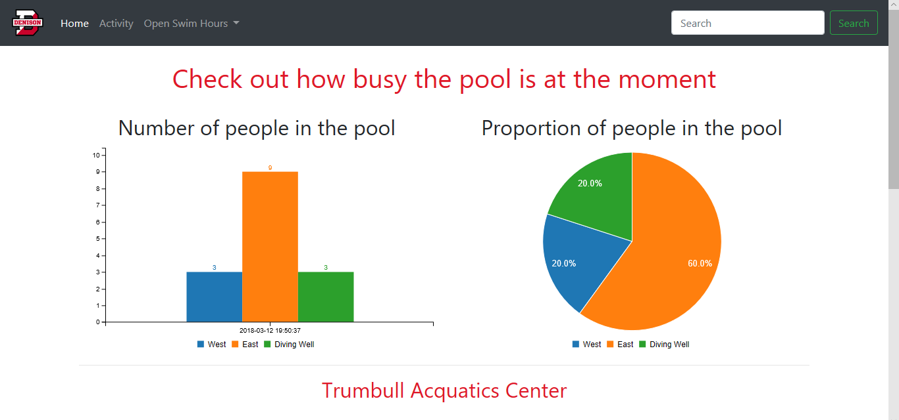

# Realtime-Graphing
Graphing data in real time
## PubNub EON
PubNub is a globally distributed realtime Data Stream Network (DNS) that manages data flow across applications globally. As a global cloud infrastrucrture, it is easy to use, more reliable and less costly in every aspect as opposed to building an infrastructure from scratch. 

Realtime data visualization is now easy with PubNub's open-source EON project. EON is a framework for creating dashboards. With EON, it is possible to graph data from an **IoT device**. 
## Internet of Things 
The Internet of Things (IoT) is a self-configuring and adaptive network which connects real-world "things" to the Internet enabling them to communicate with other "things" that ara also connected to the Internet, which leads to the realization of a new range of ubiquitous services.
The term **IoT** originates to MIT Auto-ID center when Kevin Ashton chose it in 1999. However, the concept of connecting a device to the Web was already introduced in 1982 by students of Carnegie Mellon University. IoT system consists of two groups: identification & sensing and computation, services, semantics. One way to make an IoT device visible through the Internet is to provide it with an access to a cloud server such that it can interact with the cloud exchanging data, recieveing commands and notifications. **PubNub** takes care of it all by itself enabling developers to write real-time solutions without worrying about **cloud computing.** Cloud computing is a model for enabling ubiquitous, convenient, and on-demand network access to a shared pool of resources. PubNub handles additional dimensions of IoT devices that increase their complexity such as diverse hardware, diverse operating systems and software on devices, and diverse network gateway requirements.

## PubNub EON Demo
The following demo exploits PubNub's open-source EON project for creating two real-time graphs. Although it is possible to see open hours through their website []http://www.denisonbigred.com/facilities/trumbull_aquatics_center, Trumbull Acquatics Center in Granville, Ohio currently does not have real-time tracking of how busy the pool is. It would be convenient to see the number of people in a particular part of the pool in real time. 

